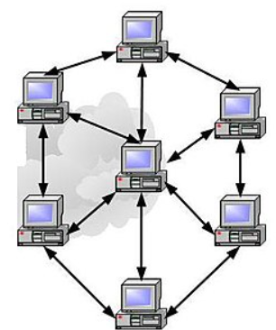

# Introduction : C'est quoi internet ?
### Un réseau informatique (en anglais : data communication network ou DCN) est un ensemble d'équipements reliés entre eux pour échanger des informations.

Donc un peu à la manière d'une toile internet est un ensemble de reseaux reliés entre-eux pour echanger des informations.

# 1 ) C'est quoi un LAN?
Un reseau LAN ( Local Network Area) est un reseau dit local car il est ne peut etre constitué que de machines proches geographiquement
les une des autres , le reseau des ordinateurs de l'ecole est un LAN , ou bien les appareils d'une maison
forment un reseau local. L'avantage est que la transmission des informations peut se faire directement entre les appareils
ce qui est securisé mais sa portée est limitée. En voici un exemple:

# 2 ) Comment deux machines communiquent ?
Il existe plusieurs modèles qui ont un nombre de "couches" qui different et qui reposent sur l'encapsulation.
### C'est quoi l'encapsulation ?
L’encapsulation dans les modèles de communication (comme le modèle OSI ou TCP/IP) est le processus par lequel chaque couche du modèle ajoute ses propres informations de contrôle (appelées en-têtes ou parfois pieds) aux données qu'elle reçoit de la couche supérieure, avant de les transmettre à la couche inférieure.
Ou autrement dit : Encapsuler, c’est emballer des données avec des informations supplémentaires nécessaires pour que la communication se fasse correctement à travers un réseau.

# 3 ) Modèles de Communication
On retrouve plusieurs modèles de communication mais voici les principaux en sachant que (OSI et  Tanenbaum sont utilisés
pour la pedagogie et que le modèle utilisé actuelement est le TCP/IP)
---

###  A ) Modèle OSI (7 couches)

| N°  | Couche             | Apport à la donnée                                               |
|-----|--------------------|-----------------------------------------------------------------|
| 7   | Application        | Interface utilisateur ; génère les données à transmettre       |
| 6   | Présentation       | Traduit, chiffre/déchiffre et compresse les données            |
| 5   | Session            | Gère les connexions, synchronise le dialogue                    |
| 4   | Transport          | Segmente les données, assure fiabilité et contrôle d'erreur    |
| 3   | Réseau             | Ajoute l’adresse IP source/destination ; routage                |
| 2   | Liaison de données | Encapsule dans des trames ; ajoute l'adresse MAC               |
| 1   | Physique           | Convertit les trames en signaux électriques ou optiques        |

---

### B ) Modèle TCP/IP (4 couches)

| N°  | Couche       | Apport à la donnée                                    |
|-----|--------------|------------------------------------------------------|
| 4   | Application  | Gère les protocoles applicatifs (HTTP, FTP, etc.)    |
| 3   | Transport    | Segmente les données, garantit la livraison (TCP/UDP)|
| 2   | Internet     | Ajoute les adresses IP pour le routage               |
| 1   | Accès réseau | Encapsulation en trame + transmission physique       |

---

### C ) Modèle de Tanenbaum (5 couches)

| N°  | Couche      | Apport à la donnée                                   |
|-----|-------------|-----------------------------------------------------|
| 5   | Application | Interagit avec l’utilisateur et génère les données |
| 4   | Transport   | Segmentation, fiabilité, détection d’erreur         |
| 3   | Réseau      | Ajoute l’adresse IP, gère le routage                 |
| 2   | Liaison     | Encapsulation en trame, ajout MAC, contrôle d’erreurs|
| 1   | Physique    | Convertit en signaux transmis sur le support        |

---
# 4 ) Correspondance matériel réel-couche

---

### A ) modèle OSI
| N° | Couche               | Exemple de matériel ou logiciel réel                             |
|----|----------------------|------------------------------------------------------------------|
| 7  | Application          | Navigateurs (Chrome, Firefox), clients mail (Outlook), Skype    |
| 6  | Présentation         | SSL/TLS (chiffrement), convertisseurs de formats (codec vidéo)  |
| 5  | Session              | API de gestion de session (Sockets, RPC), NetBIOS               |
| 4  | Transport            | Protocole TCP/UDP (géré par OS ou pare-feux)                    |
| 3  | Réseau               | Routeurs Cisco, adresse IP, commutateurs de niveau 3            |
| 2  | Liaison de données   | Switchs Ethernet, carte réseau (NIC), MAC address               |
| 1  | Physique             | Câble RJ45, fibre optique, répéteur, hub, ondes radio (Wi-Fi)   |

---

### B ) modèle TCP/IP

| N° | Couche       | Exemple de matériel ou logiciel réel                          |
|----|--------------|---------------------------------------------------------------|
| 4  | Application  | HTTP, FTP, SSH, DNS, clients mail, navigateur                 |
| 3  | Transport    | TCP, UDP (fonctionnement intégré dans le système d’exploitation) |
| 2  | Internet     | Routeurs, adresse IP, NAT                                     |
| 1  | Accès réseau | Modem, carte réseau, câble Ethernet, Wi-Fi, commutateurs      |

---

### C ) modèle de Tanenbaum

| N° | Couche      | Exemple de matériel ou logiciel réel                             |
|----|-------------|------------------------------------------------------------------|
| 5  | Application | Messagerie instantanée, navigateur, logiciels FTP                |
| 4  | Transport   | TCP, UDP, pare-feux                                              |
| 3  | Réseau      | Routeur, adresse IP, protocole ICMP                              |
| 2  | Liaison     | Switch, carte réseau (NIC), Wi-Fi Access Point                   |
| 1  | Physique    | Fibre optique, câble RJ45, radio, matériel Bluetooth             |