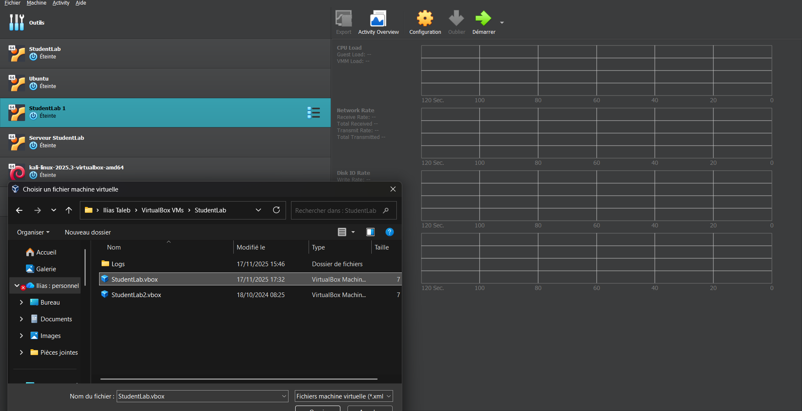
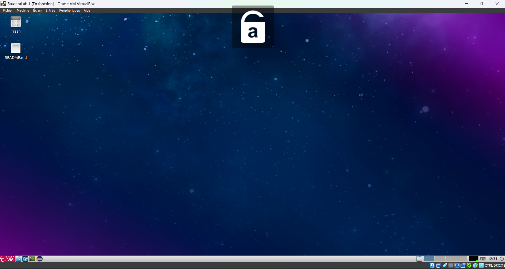

# Virtual Machine
Cette section s'attardera sur l'utilisation de **la Machine Virtuelle (VM) de l'ENSEA**.
## Introduction

Une VM est un puissant outil permettant d'avoir sur son PC un deuxième (ou autant que vous le voulez) de PC dit virtuel(s).

Plus concrètement, même si votre machine est sous l'OS Windows, grâce à l'[Oracle VirtualBox](https://www.virtualbox.org/) vous pourrez télécharger et lancer autant de VM que votre PC le permettra.

## Premiers pas et installation

Avant de pouvoir jouir de l'utilisation de VM, vous aurez besoin d'installer le lanceur de VM VirtualBox.

Dans ce cours tuto, nous verrons comment installer la Machine Virtuel de l'ENSEA qui vous permettra de disposer de nombreux outils et logiciels préinstallés  et prêts à l'emploi:

- Dans un premier temps, pour être certain de la compatibilité de la VM ENSEA avec votre version de VirtualBox, il est conseillé d'installer la version 7.0.20 [ici](https://download.virtualbox.org/virtualbox/7.0.20/VirtualBox-7.0.20-163906-Win.exe) ainsi que le [pack d'extension](https://download.virtualbox.org/virtualbox/7.0.20/Oracle_VM_VirtualBox_Extension_Pack-7.0.20.vbox-extpack) correspondant.
- Ensuite, vous pourrez télécharger la [VM de l'ENSEA](https://enseafr-my.sharepoint.com/personal/christophe_bares_ensea_fr/_layouts/15/onedrive.aspx?ga=1&view=4) en cliquant sur le fichier "StudentLab.ova".
- Lancer ensuite VirtualBox puis cliquer sur ajouter afin d'importer la VM, pour ce faire cliquer sur "fichier" puis "importer un appareil virtuel" (ou tout simplement ctrl+i), selectionner alors la VM de l'ENSEA
  
- Cliquer sur "suivant" puis "finish"
- Félicitations ! (j'espère...)

Si tout c'est bien passé, vous devrez atterir sur quelque chose du genre une fois la VM lancée:

En cours de réseau, vous apprendrez à utiliser la VM de l'ENSEA (d'ailleurs, vous pouvez dès à présent feuilleter les quelques onglets et icônes disponibles).

Si vous souhaitez aller plus loin concernant VirtualBox et les machines virtuelles, vous pourrez télecharger des machines virtuelles préfaites ou vierges comme les VM de la ditribution [Kali Linux](https://www.kali.org/get-kali/#kali-virtual-machines) dont certaines sont plus axées sur des outils de cybersécurité notamment.
